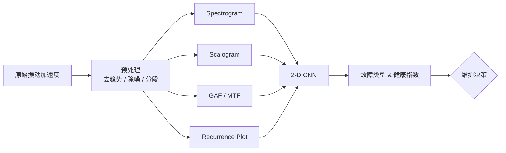

下面用一条典型的**故障诊断工作流**为主线，按“信号 → 预处理 → *-gram* 表示 → 特征/模型 → 诊断决策”的顺序，讲解工业领域最常见的几类 “**-gram**” 表示各自扮演的角色、常用参数与实践要点。为了便于横向比较，先给出总览，再逐项展开。

---

## 1. 总览速查

| *-gram* 表示                        | 主要思想                     | 何时最常用          | 输出维度        | 典型模型接口         |
| --------------------------------- | ------------------------ | -------------- | ----------- | -------------- |
| **Spectrogram (STFT)**            | 短时傅里叶，把非平稳信号拆成「局部稳态」片段   | 旋转机械、齿轮箱早期故障   | *F* × *T*   | 2-D CNN、ViT    |
| **Mel-Spectrogram**               | 在 STFT 上加 Mel 过滤器，更关注低频  | 电机噪声、声学诊断      | Mel × *T*   | 2-D CNN、CRNN   |
| **Scalogram (CWT)**               | 连续小波，解析瞬态与脉冲             | 轴承滚动体击打、放电故障   | Scale × *T* | 2-D CNN、ResNet |
| **Gramian Angular Field (GAF)**   | 将时序映射到极坐标后做余弦内积，得到对称矩阵   | 少量样本 / 图像化迁移学习 | *L* × *L*   | CNN、ConvMixer  |
| **Markov Transition Field (MTF)** | 用状态转移概率矩阵刻画动态            | 复杂工况/负载变化      | *L* × *L*   | CNN            |
| **Recurrence Plot (RP)**          | 相空间“回归”检验系统动力学           | 非线性、弱周期        | *L* × *L*   | CNN、Gram-RLSTM |
| **Cepstrogram**                   | 频谱再做对数 & IFFT，提取谐波间隔     | 声学、涡轮片裂纹       | Quef. × *T* | CNN、HMM        |
| **Envelope Spectrogram**          | Hilbert 包络 + STFT，突出冲击包络 | 深沟轴承内外圈缺陷      | *F* × *T*   | CNN            |

> **记忆锚点**：
>
> * “Spectro-”看平稳/周期；“Scalo-”抓瞬态；“-gramian / RP”把一维改二维；“Cepstro-”解决谐波重叠。

---

## 2. 典型工作流拆解

下面以旋转机械振动信号为例，示范每类 *-gram* 的具体落点（⚙️ 设备可替换为齿轮箱、压缩机等）。

### 2.1 Spectrogram（STFT）

1. **窗口划分**：常用 256/512 点 Hann 窗，50–75 % 重叠可兼顾时频分辨率。
2. **幅值处理**：取功率谱密度 (dB) + log1p 归一化，可显著压缩动态范围。
3. **建模入口**：当成 2-D 灰度或 3-channel（叠加其一阶/二阶差分）输入 CNN。
4. **专用技巧**：

   * *Time-mask / Freq-mask* 数据增强（借鉴 SpecAugment）。
   * 同步边带包络可帮助检测转速波动。

### 2.2 Mel-Spectrogram

* **动机**：故障早期能量往往集中在低频，Mel 尺度对低频加密、更贴近人耳感知。
* **实现**：STFT 后乘 Mel Filterbank（40–128 组常见），再做对数。
* **注意**：转速较高、谐波多的设备不宜盲目 Mel 化（低频压缩会损失细节）。

### 2.3 Scalogram（CWT）

1. **母小波选择**：机械故障 → Morlet 或 bump；电气局放 → Mexican-hat。
2. **尺度范围**：对应频率覆盖 0.5 ×～2 × 转频能捕获故障侧带。
3. **输出尺寸**：常见 224 × 224，便于迁移 ResNet-50。
4. **优势**：瞬态冲击易在高尺度呈“束状”高亮，CNN 学习边缘特征效果显著。

### 2.4 GAF / MTF

> **核心**：「把 1-D 时序 → 2-D 图片」= 无需手工时频变换，CNN 可重用 ImageNet 权重。

* **步骤**

  1. **归一化**：将序列映射到 $[-1,1]$；
  2. **极坐标变换**：$x_t \to (\phi_t = \arccos(x_t), r_t = t/N)$；
  3. **Gramian 计算**：$G_{i,j} = \cos(\phi_i+\phi_j)$ (GASF) 或差分版 (GADF)。
  4. **(MTF)**：先把序列分箱，统计转移概率，得到 $P_{i,j}$。
* **实践**

  * *L*（序列截断长度）须固定，如 256/512；
  * 图像对角线沿时间轴，视觉上易读“节奏感”。
  * 对小数据集（<1000 条）+ 迁移学习尤其高效。

### 2.5 Recurrence Plot (RP)

* **思想**：用阈值 $\epsilon$ 判断“系统状态是否回到曾经的邻域”。
* **流程**

  1. 嵌入维度 & 延迟：$m,\,\tau$ 由假最近邻 & 自相关选取；
  2. 构建距离矩阵 $\|X_i - X_j\|$；
  3. 置 1/0 得到二进制图。
* **诊断亮点**：不同故障模式→不同“纹理”(点/线/块)，CNN 擅长捕捉。
* **坑点**：阈值过小→过稀；过大→全黑，需网格搜索或自适应阈值。

### 2.6 Cepstrogram & Envelope Spectrogram

* **Cepstrogram**：先取对数功率谱，再 IFFT；X 轴 quefrency 直接透露谐波间隔，适合裂纹产生的 sideband。
* **Envelope Spectrogram**：Hilbert 包络后再 STFT，把冲击能量挤到低频，更突出轴承滚道缺陷。

---

## 3. 多 *-gram* 融合策略

| 融合层级    | 做法                                   | 工程建议                |
| ------- | ------------------------------------ | ------------------- |
| **输入级** | 将不同 *-gram* 通道级拼接 (e.g., STFT ⊕ CWT) | 找到公共分辨率后再拼；避免空洞插值   |
| **特征级** | 两分支 CNN → concat → FC                | 共享底层参数可节省算力         |
| **决策级** | 独立模型 soft-vote / 加权平均                | 适合已有 legacy 模型时渐进升级 |

---

## 4. 选型捷径

1. **早期裂纹/冲击**：Scalogram 或 Envelope Spectrogram
2. **噪声淹没、数据稀缺**：GAF/MTF（配迁移学习）
3. **复杂工况 & 负荷变速**：STFT + 频率重对齐 / RP
4. **声学 + 振动多模态**：Mel-Spectrogram (声) ⊕ STFT (振) 双通路

---

### 5. 小结

* “*-gram*” 本质是把 **时序 → 时-频 / 时-时** 二维结构，为 CNN/ViT 这类图像模型“铺路”。
* 不要忽视 **预处理** 与 **参数选择**：同一信号，不同窗长或小波尺度，诊断表现可差一个数量级。
* **融合 > 单一**：多角度视图往往带来鲁棒性 & 早期异常捕捉能力的提升。

希望以上拆解能帮助你快速定位不同 *-gram* 在故障诊断流程中的最佳落点。如果需要针对具体设备或数据集的参数调优示例，随时告诉我！
